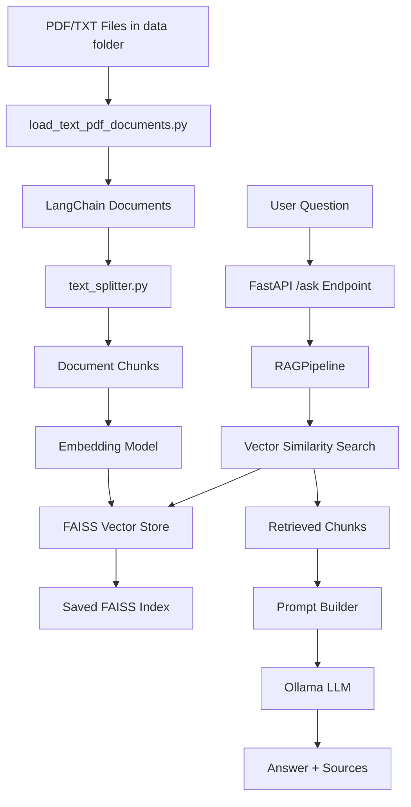
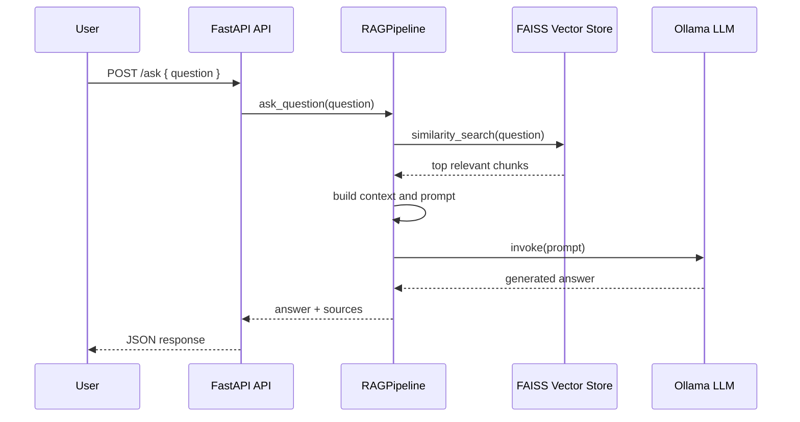
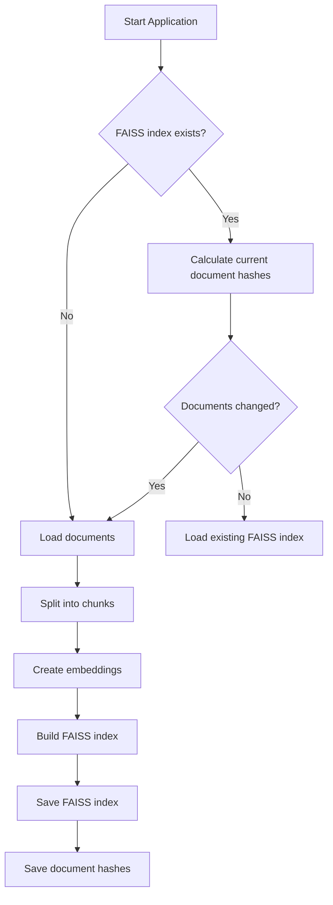

# AI RAG Assistant

A local Retrieval-Augmented Generation (RAG) application built with Python, LangChain, FAISS, Ollama, and FastAPI.

The system loads PDF/TXT documents, chunks them, creates embeddings, stores them in a FAISS vector database, and retrieves relevant context for LLM-based question answering.

---

# Features

- Local RAG pipeline
- PDF and TXT ingestion
- LangChain document processing
- Recursive text chunking
- Sentence-transformer embeddings
- FAISS vector similarity search
- Ollama local LLM integration
- Persistent FAISS index
- Automatic document change detection
- FastAPI backend
- Swagger API documentation

---

# Tech Stack

| Technology            | Purpose                     |
| --------------------- | --------------------------- |
| Python                | Main language               |
| LangChain             | RAG orchestration utilities |
| FAISS                 | Vector similarity search    |
| Ollama                | Local LLM serving           |
| FastAPI               | Backend API                 |
| Pydantic              | Request/response validation |
| Sentence Transformers | Embedding generation        |
| PyPDF                 | PDF parsing                 |

---

# Project Structure

```text
ai-rag-assistant/
│
├── api/
│   ├── __init__.py
│   └── app.py
│
├── data/
│
├── faiss_index/
│
├── config.py
├── display.py
├── index_metadata.py
├── load_text_pdf_documents.py
├── main.py
├── rag_pipeline.py
├── rag_service.py
├── text_splitter.py
├── vector_store.py
│
├── requirements.txt
└── README.md
```

---

# Low-Level Design

| Component                    | Responsibility                                                  |
| ---------------------------- | --------------------------------------------------------------- |
| `main.py`                    | CLI entry point for local testing                               |
| `api/app.py`                 | FastAPI backend exposing `/ask` endpoint                        |
| `rag_pipeline.py`            | High-level orchestrator/facade for the RAG workflow             |
| `load_text_pdf_documents.py` | Loads `.pdf` and `.txt` files into LangChain `Document` objects |
| `text_splitter.py`           | Splits documents into smaller chunks                            |
| `vector_store.py`            | Creates, saves, loads, and searches FAISS vector store          |
| `rag_service.py`             | Builds context, prompt, retrieves docs, and generates answer    |
| `index_metadata.py`          | Detects document changes using file hashes                      |
| `display.py`                 | CLI output formatting                                           |
| `config.py`                  | Central configuration values                                    |

---

# Architecture Diagram



---

# Runtime Request Flow



---

# Indexing / Persistence Flow



---

# API Contract

## POST `/ask`

Request:

```json
{
  "question": "What are the documents about?"
}
```

Response:

```json
{
  "answer": "Generated answer based on retrieved context.",
  "sources": [
    {
      "file_name": "example.pdf",
      "page": 2,
      "source": "data/example.pdf"
    }
  ]
}
```

---

# Setup

## 1. Create virtual environment

```bash
python -m venv .venv
```

## 2. Activate environment

### Windows

```bash
.venv\Scripts\activate
```

### Linux/Mac

```bash
source .venv/bin/activate
```

## 3. Install dependencies

```bash
pip install -r requirements.txt
```

---

# Ollama Setup

Install Ollama:

https://ollama.com/

Pull local model:

```bash
ollama pull phi3
```

---

# Running the FastAPI Server

```bash
uvicorn api.app:app --reload
```

Open Swagger docs:

```text
http://127.0.0.1:8000/docs
```

---

# Running Local CLI Version

```bash
python main.py
```

---

# Current Design Principles

- Separation of concerns between loading, splitting, vector storage, RAG logic, API, and display
- Reusable `RAGPipeline` class to hold state such as vector store and LLM instance
- FAISS persistence to avoid rebuilding embeddings every run
- Document hash metadata to rebuild the index only when source files change
- FastAPI layer wraps the RAG pipeline without mixing API logic into core RAG logic

---

# Future Improvements

- Streamlit frontend
- File upload support
- Incremental indexing
- Async inference
- Conversation memory
- Multi-user sessions
- Cloud deployment
- Better embedding models
- Hybrid retrieval
- Evaluation pipeline
